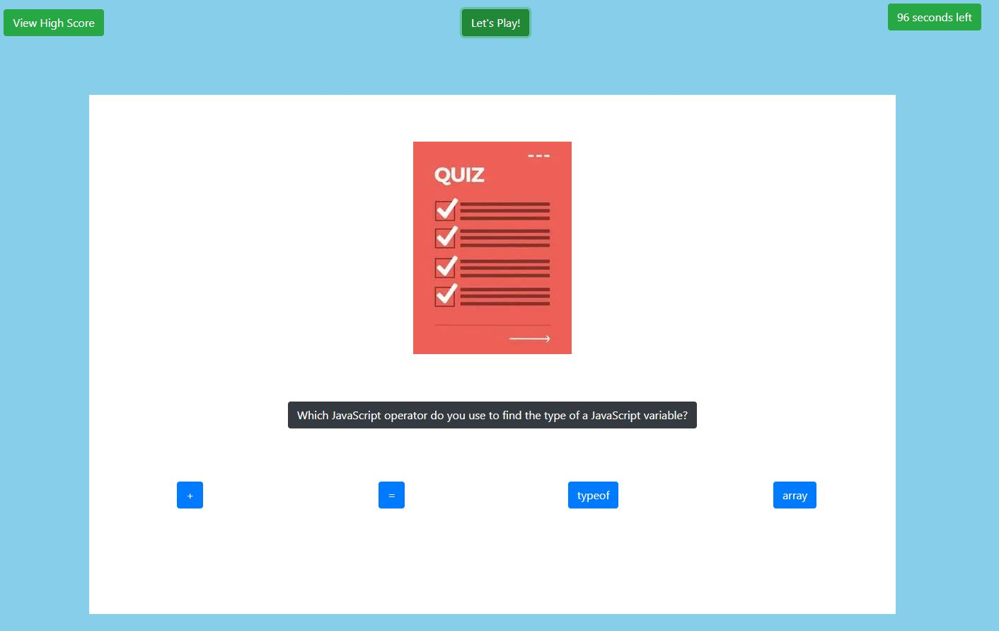

# WebAPICodingQuiz

This is WEBAPI Coding Quiz Project. 

It will ask the user to take coding quiz. For each question, user will be asked to choose from four choices as an answer for the according question. If the user gets it right, the user is awarded with points. If the user gets a question wrong, the user will lose 10 seconds.

When all the questions are all answered or the timer reaches 0, the game is over.

When the game is over, the user is prompted to put his or her initials to leave the score on the scoreboard.

The score will be stored in local storage and will be accessible even when the page is refreshed.

User is able to view the scoreboard anytime by pressing scoreboard button.

Through this project, I have learned how to use DOM and time manipulation.

https://chong0810.github.io/WebAPICodingQuiz/

